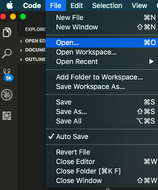
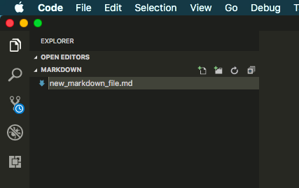
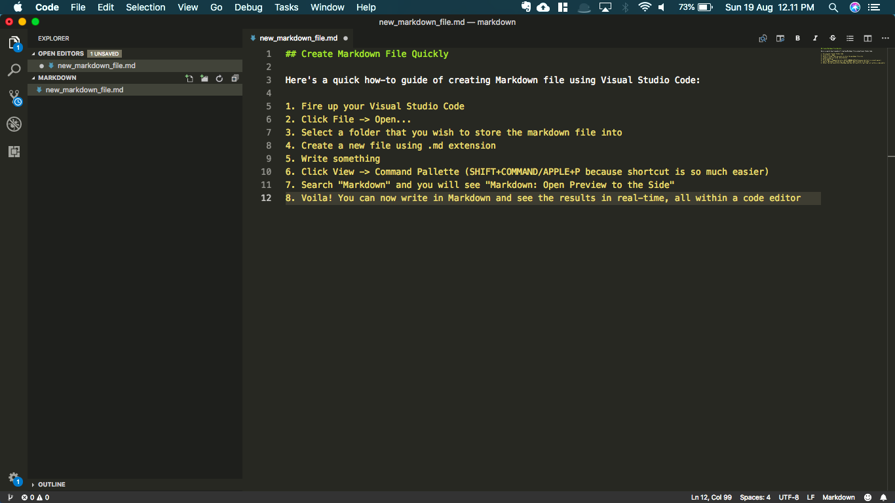
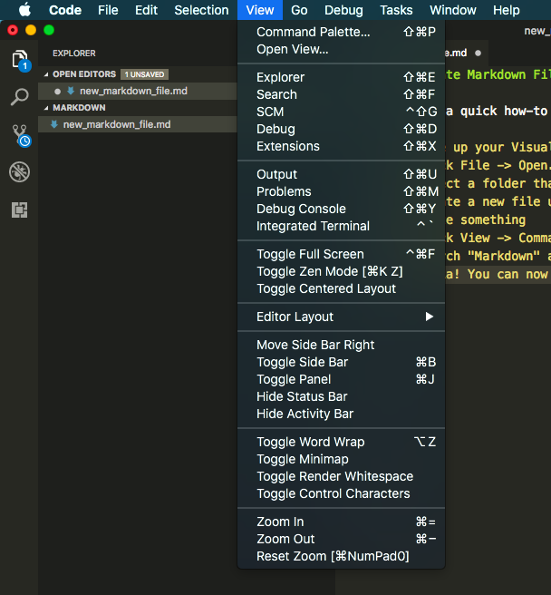
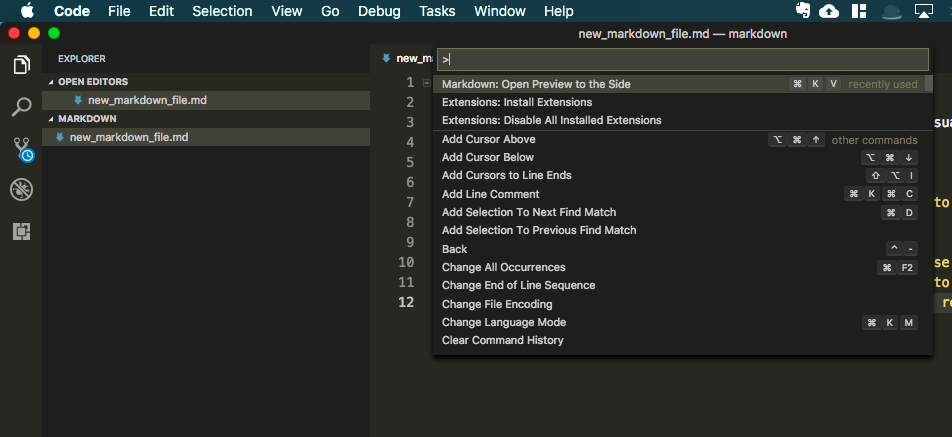
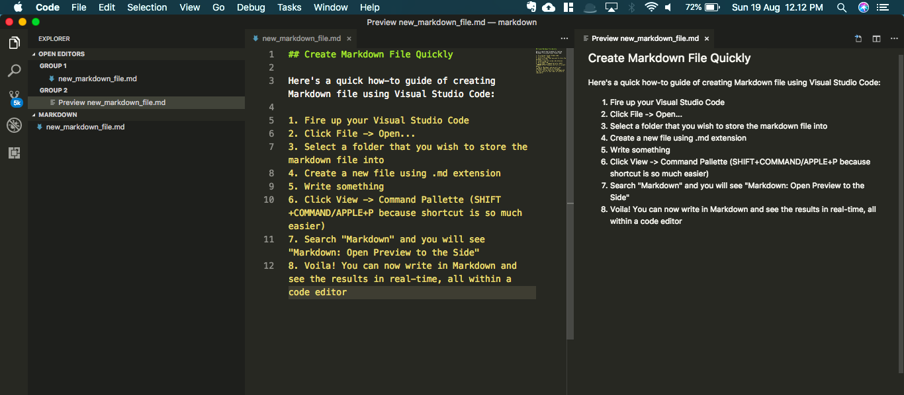

# How-To Guide: Markdown in Visual Studio Code

Markdown, to be frank, is both a revelation and a revolution in the era of the Internet and software development. Markdown as a lightweight markup language has been used extensively by web writers and developers in very popular sites for quite some time, the most popular one is, quite possibly, GitHub. Imagine if Microsoft in the 90's created Microsoft Word, but for the Internet? That would be Markdown. Markdown is a plain-text format, converted to structurally valid HTML. 

So naturally, if you are a writer, a developer, or aspire to be either one (or both) someday, it won't hurt if you learn how to write using Markdown. At the very least, you will still need Markdown to write a readme.md file to your GitHub repository.

Unfortunately, since Markdown uses syntax for text formatting, you will need to have a good tool to translate from plain text to beautiful, formatted document.

You might ask then, what code editor can handle Markdown from the get-go? Well, the most practical one is obvious: Visual Studio Code!

_(Disclaimer: this is not a paid promotion by Visual Studio Code team. I am merely showing my passion on the code editor that I use the most (currently), thus I want to share these simple tips with you.)_

By default, Visual Studio Code has been equipped to compile Markdown. So right now, no need to install Markdown extensions just yet, unless you really need the urge to do more specific things (more on that later).

---

## Create Markdown File Quickly

Here's a quick how-to guide of creating Markdown file using Visual Studio Code:

1. Fire up your Visual Studio Code

2. Click File -> Open...

3. Select a folder that you wish to store the markdown file into

4. Create a new file using .md extension

5. Write something

6. Click View -> Command Pallette (SHIFT+COMMAND/APPLE+P because shortcut is so much easier)

7. Search "Markdown" and you will see "Markdown: Open Preview to the Side"

8. Voila! You can now write in Markdown and see the results in real-time, all within a code editor

---

## Install Extensions

To get even more power from Markdown editing in Visual Studio Code, you can also elect to install these cool extensions:

1. [Markdown Shortcuts](https://marketplace.visualstudio.com/items?itemName=mdickin.markdown-shortcuts) by mdickin: cool shortcuts at your perusal when you do your Markdown editing (it will appear in Command Pallette after you install)
2. [markdownlint](https://marketplace.visualstudio.com/items?itemName=DavidAnson.vscode-markdownlint) by David Anson: the name says it all - it's a Markdown linting and style checking for Visual Studio Code
3. [Markdown TOC](https://marketplace.visualstudio.com/items?itemName=AlanWalk.markdown-toc) by AlanWalk: generate table of contents of headlines from parsed Markdown file, quite handy if you need to write some step-by-step instructions too

---

All right, that's all I can share for now. Have an awesome day!

(This post was first appeared in my GitHub)